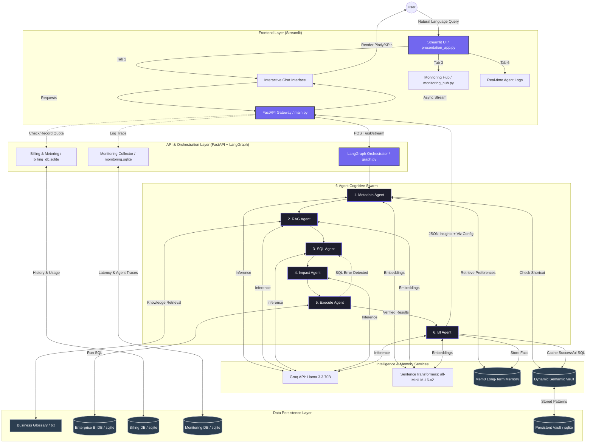

# NeuroQuery: Enterprise Multi-Agent BI Framework

## 1. Project Overview
**NeuroQuery** is a high-performance, multi-agent AI framework designed for Enterprise Business Intelligence. It transforms natural language into actionable SQL queries, performs security and impact analysis, and leverages a dynamic learning loop to improve accuracy and speed over time.

The system is built on a "Self-Healing" architecture that automatically detects and fixes SQL errors, ensuring reliable data extraction even with complex, ambiguous user requests.

---

## 2. Technical Stack
| Category | Technology | Purpose |
| :--- | :--- | :--- |
| **Logic & API** | Python 3.11+, FastAPI | Core backend and orchestration. |
| **Orchestration** | LangGraph, LangChain | Managing multi-agent state and cycles. |
| **LLM Provider** | Llama 3.3 70B (via Groq API) | High-speed inference and reasoning. |
| **Embeddings** | SentenceTransformers (`all-MiniLM-L6-v2`) | Semantic search for Vault and RAG. |
| **Memory** | Mem0 | Long-term user memory and fact-tracking. |
| **Caching** | Dynamic Semantic Vault (SQLite) | Instant recovery of previously successful queries. |
| **Database** | SQLAlchemy + SQLite | Enterprise data simulation and persistence. |
| **UI** | Streamlit | Modern BI analytics dashboard. |
| **Metering** | Custom SQLite Middleware | Usage tracking and quota enforcement. |

---

## 3. Detailed Architecture Diagram



---

## 4. Component Definitions

### A. Agents & Roles
1.  **Metadata Agent (`metadata_agent.py`)**: 
    *   **Normalization:** Fixes typos and expands incomplete queries.
    *   **Routing:** Identifies which of the 15 enterprise tables are needed.
    *   **Memory Integration:** Fetches historical user facts from **Mem0**.
    *   **Shortcut Engine:** Queries the **Semantic Vault** to skip AI generation if a similar query exists.

2.  **RAG Agent (`rag_agent.py`)**: 
    *   **Knowledge Retrieval:** Performs vector search over `business_glossary.txt`.
    *   **Rule Injection:** Appends domain-specific logic (e.g., "Revenue = Sales - Returns") to the prompt.

3.  **SQL Agent (`sql_agent.py`)**:
    *   **Query Synthesis:** Generates optimized SQLite code using the schema, RAG rules, and user context.
    *   **Reflexion:** Analyzes errors from previous attempts to self-correct the SQL.

4.  **Impact Agent (`impact_agent.py`)**:
    *   **Security Scanning:** Detects PII access (email, address) or destructive operations (DROP, DELETE).
    *   **Cost Estimation:** Forecasts query complexity based on table joins.

5.  **Execute Agent (`execute_agent.py`)**:
    *   **Query Runner:** Securely connects to the BI database and handles transaction lifecycle.
    *   **Error Capture:** Passes raw database errors back to the graph for self-healing.

6.  **BI Agent (`bi_agent.py`)**:
    *   **Interpretation:** Converts raw SQL rows into high-level business insights and KPIs.
    *   **Learning Loop:** Persists successful SQL results into the Semantic Vault for 1ms future response times.

---

## 5. Complex Example Walkthrough

### Scenario
**Question:** *"Calculate the 2024 revenue growth for my 'Elite' customers in the California region. Use my preference for 'net revenue' which excludes tax."*

### Step-by-Step System Flow

#### 1. Metadata Normalization (`metadata_agent.py`)
*   **Action:** Detects "California" and "Elite" customers.
*   **Memory:** Checks Mem0 for "preference for net revenue". It finds a previous interaction where the user defined "net revenue" as `revenue - tax`.
*   **Output:** Corrected Question: "Show total revenue minus tax for loyalty_tier 'Elite' in the California region for 2024."
*   **Files Involved:** `app/agents/metadata_agent.py`, `app/memory/mem0_client.py`

#### 2. Domain Context Retrieval (`rag_agent.py`)
*   **Action:** Embeds the question and searches `business_glossary.txt`.
*   **Result:** Finds a business rule stating: *"Regional growth comparisons should use the 'regions' table for manager-level reporting."*
*   **Files Involved:** `app/agents/rag_agent.py`, `data/business_glossary.txt`

#### 3. Enterprise SQL Generation (`sql_agent.py`)
*   **Action:** Combines the schema of `sales`, `customers`, and `regions` tables with the "net revenue" formula.
*   **SQL Created:** 
    ```sql
    SELECT SUM(s.revenue - s.tax) as net_revenue 
    FROM sales s 
    JOIN customers c ON s.customer_id = c.customer_id 
    JOIN regions r ON s.region = r.name 
    WHERE c.loyalty_tier = 'Elite' 
      AND r.name = 'California' 
      AND s.date LIKE '2024%';
    ```
*   **Files Involved:** `app/agents/sql_agent.py`

#### 4. Safety & Impact Analysis (`impact_agent.py`)
*   **Action:** Analyzes the SQL for risk. It notes that a 3-table JOIN is being performed.
*   **Result:** Status: `Safe`, Risk: `Medium` (due to complexity), Sensitive Data: `None`.
*   **Files Involved:** `app/agents/impact_agent.py`

#### 5. Database Execution & Self-Healing (`execute_agent.py` + `graph.py`)
*   **Action:** Runs the query against `enterprise_bi_db.sqlite`.
*   **Reflexion Loop:** If the SQL Agent accidentally used a non-SQLite function (like `GETDATE()`), the Execute Agent catches the exception. The **LangGraph** `should_continue` condition triggers a "Retry", sending the error back to the SQL Agent, which then regenerates the query using `strftime()` instead.
*   **Files Involved:** `app/agents/execute_agent.py`, `app/langgraph/graph.py`

#### 6. Business Intelligence Interpretation (`bi_agent.py`)
*   **Action:** Receives the numeric result. Calculates that the value represents a $4.2M net revenue.
*   **Learning:** Calls `add_to_vault()` to save this exact SQL mapping.
*   **Memory:** Updates Mem0: "User analyzed 2024 California Elite revenue."
*   **Files Involved:** `app/agents/bi_agent.py`, `app/agents/vault.py`

#### 7. Final Response Generation
*   **Output:** The UI displays a primary KPI of $4,200,000, a table of top performers, and a clear natural language explanation of the steps taken.

---

## 6. Dynamic Performance & Learning
*   **Semantic Vault:** The system doesn't just cache exact strings; it uses **Cosine Similarity** (threshold > 0.65). If a user asks "Show me 2024 growth for Elite in CA" next time, the system will identify it as a match to the previous query and serve the result **instantly** without calling the LLM. ⚡
*   **Self-Healing:** Retries up to 3 times with error feedback, achieving near-100% SQL accuracy.
